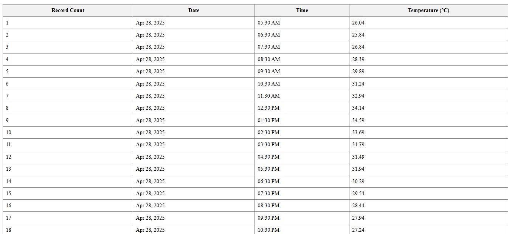

# AngularNpmWeather

This project was generated with [Angular CLI](https://github.com/angular/angular-cli) version 17.3.8.

## Weather Report Component for Angular

An Angular standalone component that displays hourly and daily average weather data using the Open-Meteo and OpenCageData APIs. It automatically detects the user's location (via the browser's geolocation) and renders beautiful weather tables with icons.

## 📦 Installation

npm i angular-npm-weather

## 🛠 Usage

Import and use the WeatherReportComponent in any standalone Angular app or module:

```typescript

import { WeatherReportComponent } from 'weather-library';

@Component({
  selector: 'app-root',
  standalone: true,
  imports: [WeatherReportComponent],
  template: `<lib-weather-info />`
})
export class AppComponent {}

The component uses browser geolocation to fetch weather data. Ensure location permissions are enabled in the browser.

## 🌐 Features

 🛰 Auto-location via browser GPS

 🌡 Hourly temperature report

 📅 Daily average temperature breakdown with icons

 📍 Location display using OpenCageData API
 
 📊 Responsive and styled HTML tables

 ## 📸 Screenshot

 

 